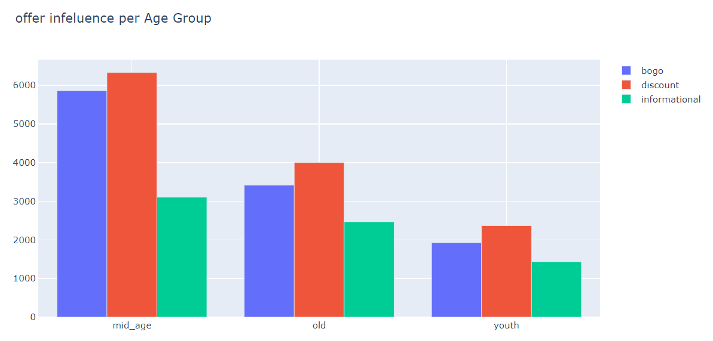
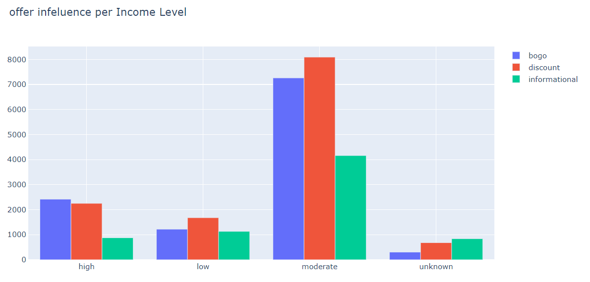

# Project Definition

In this project, I will study the behaviors of Starbucks coffee customers and how they change during offer periods and study these customers' minds and how they respond to delicious offers. The store poses it, and I will try to record useful results with two questions:

 - How far is the revenue in the period of the shows?
 - Who are the customers who are interested in these offers?
 - The results appeared as follows:

# Analysis
1- By reviewing the data we have in the data frame, which is called Portfolio, and the data frame, which is called Transcript, we discovered that the units of measurement for each of them are different because one of the data shreds measured at times and the other in days

2- We discovered that the overwriters are of the informationonal type, not the same as the complete record in the transcript.

3- We discovered empty values ​​in the special column in the Ginder and the column specific to the incom in the data frame, whose name is Profile

4- We also discovered that the column named Value Transcript Data Frame contains two different information:

A- It is the offer ID

B- It is Amount Trans Action

5- The id offer appeared in two ways in the column named Values:

A- The first method offer_id

B- The second method is offer id

# methodology
1- The first step: We will convert the income data from continuous to categorical data, and make them 4 groups:

A-group whose income is unknown

B- Low,  income group

C-middle  income group

d-high income group

Regarding age, we have divided it into 3 sections:
a- old over 65 yours old
b- middle age "40-65"
c- youth under 40 yours old

Then we went to the Value column in the Data Frame called Transcript
We extracted two columns from it:
A-column for the amount
B-offer id
After this we looked for each offer received record of the offer viewd record, the offer completed record
During the  offer's time

# visualisation

## In terms of age groups:

## Changes in revenue:

 We can deduce from the above statistics that the change in prices clearly changes the behavior of the customers
 In all target groups, the same rule applies to revenues
 
 
 # model
In the model we will try to predict whether or not the person will complete our offer based on the offer data and the person’s data such as income, age, and gender
 
 First we will do scaling for numerical data And we'll dummy columns of the categorized data
 And we used two algorithms:

Logistic regression
B- SVC

In both cases, the accuracy does not exceed 60%.
